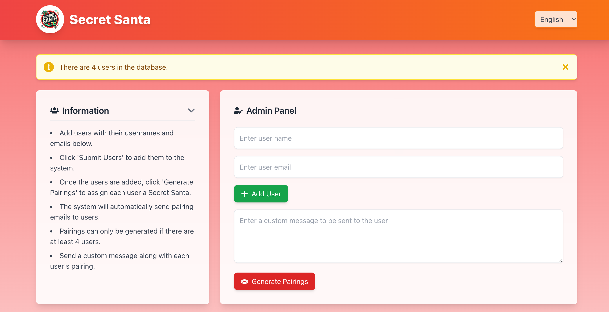

# 🎅 Secret Santa Generator 🎄

Welcome to the **Secret Santa Generator** web application! This app allows users to create Secret Santa groups, randomly assign participants to each other, and notify them via email. It is built using **Next.js**, styled with **Tailwind CSS**, and connected to a **SQLite** database via **Prisma ORM**. The app also uses **Nodemailer** to send email notifications to participants with their assigned Secret Santa.

## 🚀 Features

- **Next.js**: Fast and scalable React framework for building web applications.
- **Tailwind CSS**: A utility-first CSS framework for quick and responsive styling.
- **Prisma ORM**: Type-safe ORM to interact with the SQLite database.
- **SQLite3**: Lightweight, serverless database engine for storage.
- **React Icons**: Customizable SVG icons for React components.
- **Nodemailer**: Sends email notifications to users with their Secret Santa assignment.

---

---
## 📦 Installation

To get the **Secret Santa Generator** app running on your local machine, follow these steps:

### 1. Clone the repository:


### 2. Install dependencies:

```bash
npm install
```

### 3. Set up the database:

Generate the Prisma database schema and migrate the SQLite database with this command:

```bash
npx prisma migrate dev
```

### 4. Configure Nodemailer:

To send emails, you'll need to configure **Nodemailer** with your email service credentials. Add the following to your `.env` file:

```plaintext
EMAIL_HOST=smtp.gmail.com
EMAIL_PORT=587
EMAIL_USER=your-email@gmail.com
EMAIL_PASS=your-email-password
```

> **Important:** If using Gmail, you may need to enable access for less secure apps or use OAuth for better security.

### 5. Start the development server:

```bash
npm run dev
```

The app will now be running at `http://localhost:3000`. Open your browser to interact with the Secret Santa Generator app.

---

## 📐 Technologies Used

This project utilizes the following technologies:

- **Next.js**: React framework for building server-rendered web applications.
- **Tailwind CSS**: Utility-first CSS framework for quick styling and responsive design.
- **Prisma ORM**: Type-safe ORM for interacting with the SQLite database.
- **SQLite3**: Lightweight and serverless database engine for local storage.
- **React Icons**: Customizable and scalable icons for React components.
- **Nodemailer**: Email-sending functionality for sending out Secret Santa assignments.

---


## 📝 License

This project is licensed under the MIT License - see the [LICENSE](LICENSE) file for details.

---

## 🌟 Acknowledgements

Special thanks to the following tools and libraries that made this project possible:

- [Next.js](https://nextjs.org/) for the React framework.
- [Tailwind CSS](https://tailwindcss.com/) for easy and flexible styling.
- [Prisma ORM](https://www.prisma.io/) for managing the SQLite database with type safety.
- [SQLite3](https://www.sqlite.org/) for the lightweight database engine.
- [React Icons](https://react-icons.github.io/react-icons/) for customizable icons.
- [Nodemailer](https://nodemailer.com/) for sending email notifications.

---
